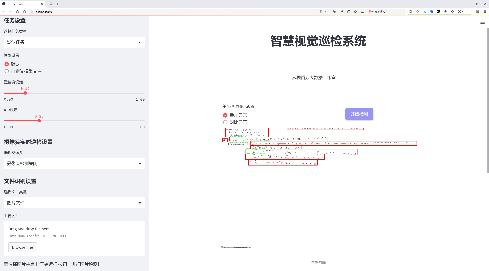

# 文档信息提取检测系统源码分享
 # [一条龙教学YOLOV8标注好的数据集一键训练_70+全套改进创新点发刊_Web前端展示]

### 1.研究背景与意义

项目参考[AAAI Association for the Advancement of Artificial Intelligence](https://gitee.com/qunmasj/projects)

项目来源[AACV Association for the Advancement of Computer Vision](https://kdocs.cn/l/cszuIiCKVNis)

研究背景与意义

在信息化快速发展的今天，文档信息提取技术逐渐成为各行业数字化转型的重要组成部分。随着文档数量的激增，如何高效、准确地从海量文档中提取有价值的信息，成为了一个亟待解决的技术难题。传统的文档信息提取方法往往依赖于规则和模板，难以适应多样化的文档格式和内容，且在处理复杂文档时准确率较低。因此，基于深度学习的目标检测技术，尤其是YOLO（You Only Look Once）系列模型，因其高效性和准确性，逐渐受到研究者的关注。

YOLOv8作为YOLO系列的最新版本，具有更强的特征提取能力和更快的推理速度，能够在实时处理场景中展现出优越的性能。针对文档信息提取的需求，改进YOLOv8模型以适应特定的文档结构和信息类型，将为信息提取提供一种新的解决方案。根据我们的研究，数据集包含4600张图像，涵盖了6个类别，包括“gambar”（图像）、“identitas”（身份）、“nomor”（号码）、“penanda_jawaban”（答案标记）、“teks_mtk”（数学文本）和“teks_salah”（错误文本）。这些类别的多样性为模型的训练提供了丰富的样本，有助于提高模型在不同文档类型上的泛化能力。

通过对YOLOv8的改进，我们旨在提升其在文档信息提取中的表现，尤其是在处理复杂布局和多样化内容时的准确性和鲁棒性。研究表明，深度学习模型在特征学习和模式识别方面具有显著优势，能够有效地捕捉文档中的关键信息。改进后的YOLOv8模型将通过引入新的特征提取模块和优化的损失函数，增强对文档结构的理解，从而提高信息提取的精度。

此外，文档信息提取系统的应用前景广泛，涵盖了金融、法律、教育等多个领域。在金融行业，自动化的信息提取能够加速数据处理，降低人工成本，提高工作效率；在法律领域，快速准确地提取合同和法律文书中的关键信息，能够帮助律师更好地进行案件分析；在教育领域，自动识别和提取试卷中的答案和文本信息，有助于实现智能化的考试评估。因此，基于改进YOLOv8的文档信息提取系统不仅具有重要的学术价值，也具有显著的实际应用意义。

综上所述，基于改进YOLOv8的文档信息提取系统的研究，不仅填补了现有技术在文档处理领域的空白，也为相关行业的数字化转型提供了新的思路和方法。通过本研究，我们期望能够推动文档信息提取技术的发展，提升其在实际应用中的有效性和可靠性，为各行业的信息化建设贡献力量。

### 2.图片演示





##### 注意：由于此博客编辑较早，上面“2.图片演示”和“3.视频演示”展示的系统图片或者视频可能为老版本，新版本在老版本的基础上升级如下：（实际效果以升级的新版本为准）

  （1）适配了YOLOV8的“目标检测”模型和“实例分割”模型，通过加载相应的权重（.pt）文件即可自适应加载模型。

  （2）支持“图片识别”、“视频识别”、“摄像头实时识别”三种识别模式。

  （3）支持“图片识别”、“视频识别”、“摄像头实时识别”三种识别结果保存导出，解决手动导出（容易卡顿出现爆内存）存在的问题，识别完自动保存结果并导出到tempDir中。

  （4）支持Web前端系统中的标题、背景图等自定义修改，后面提供修改教程。

  另外本项目提供训练的数据集和训练教程,暂不提供权重文件（best.pt）,需要您按照教程进行训练后实现图片演示和Web前端界面演示的效果。

### 3.视频演示

[3.1 视频演示](https://www.bilibili.com/video/BV1y1xFeYEgU/)

### 4.数据集信息展示

##### 4.1 本项目数据集详细数据（类别数＆类别名）

nc: 6
names: ['gambar', 'identitas', 'nomor', 'penanda_jawaban', 'teks_mtk', 'teks_salah']


##### 4.2 本项目数据集信息介绍

数据集信息展示

在本研究中，我们采用了名为“bounding box”的数据集，以支持对YOLOv8模型的改进，特别是在文档信息提取系统的训练过程中。该数据集的设计旨在提供多样化的文档图像，涵盖了不同类型的信息元素，能够有效地帮助模型学习和识别文档中的关键信息。数据集的类别数量为六个，具体类别包括：'gambar'（图像）、'identitas'（身份信息）、'nomor'（号码）、'penanda_jawaban'（答案标记）、'teks_mtk'（数学文本）和'teks_salah'（错误文本）。这些类别的选择不仅考虑了文档信息提取的实际需求，还充分反映了不同信息类型在文档中的重要性。

首先，'gambar'类别主要涉及文档中出现的图像部分，这些图像可能是图表、照片或其他视觉元素。识别这些图像对于理解文档的整体内容至关重要，因为图像往往承载着丰富的信息。其次，'identitas'类别则专注于身份信息的提取，这在许多应用场景中都显得尤为重要，例如在身份证明、注册表单等文档中，身份信息的准确提取能够直接影响后续的数据处理和决策。

'Nomor'类别则涵盖了文档中出现的各种号码，如身份证号码、电话号码、订单号等。这些数字信息通常是文档中最为关键的部分，准确的提取能够帮助用户快速定位和检索相关信息。接下来，'penanda_jawaban'类别主要用于标记文档中的答案部分，尤其是在考试或问卷调查等场景中，识别这些答案标记对于后续的评分和分析至关重要。

此外，'teks_mtk'类别专注于数学文本的提取，数学文本在教育和科研领域中具有特殊的地位，准确识别和提取这些文本能够为后续的数学分析和计算提供基础。而'teks_salah'类别则用于识别文档中可能存在的错误文本，这对于提高文档处理的准确性和可靠性具有重要意义。

整个数据集的构建过程遵循了严格的标注标准，确保每个类别的样本都经过精确的标注，以便为YOLOv8模型的训练提供高质量的数据支持。数据集中的每一张图像都经过仔细的审查和处理，确保标注的准确性和一致性。此外，数据集还考虑到了多样性和代表性，涵盖了不同类型的文档和信息布局，以增强模型的泛化能力。

通过对“bounding box”数据集的深入分析和应用，我们期望能够显著提升YOLOv8在文档信息提取任务中的表现，使其在实际应用中更具实用性和可靠性。随着数据集的不断扩展和优化，我们相信该系统将能够适应更多复杂的文档处理需求，为相关领域的研究和应用提供强有力的支持。


### 5.全套项目环境部署视频教程（零基础手把手教学）

[5.1 环境部署教程链接（零基础手把手教学）](https://www.ixigua.com/7404473917358506534?logTag=c807d0cbc21c0ef59de5)


[5.2 安装Python虚拟环境创建和依赖库安装视频教程链接（零基础手把手教学）](https://www.ixigua.com/7404474678003106304?logTag=1f1041108cd1f708b01a)

### 6.手把手YOLOV8训练视频教程（零基础小白有手就能学会）

[6.1 手把手YOLOV8训练视频教程（零基础小白有手就能学会）](https://www.ixigua.com/7404477157818401292?logTag=d31a2dfd1983c9668658)

### 7.70+种全套YOLOV8创新点代码加载调参视频教程（一键加载写好的改进模型的配置文件）

[7.1 70+种全套YOLOV8创新点代码加载调参视频教程（一键加载写好的改进模型的配置文件）](https://www.ixigua.com/7404478314661806627?logTag=29066f8288e3f4eea3a4)

### 8.70+种全套YOLOV8创新点原理讲解（非科班也可以轻松写刊发刊，V10版本正在科研待更新）

由于篇幅限制，每个创新点的具体原理讲解就不一一展开，具体见下列网址中的创新点对应子项目的技术原理博客网址【Blog】：


[8.1 70+种全套YOLOV8创新点原理讲解链接](https://gitee.com/qunmasj/good)

### 9.系统功能展示（检测对象为举例，实际内容以本项目数据集为准）

图9.1.系统支持检测结果表格显示

  图9.2.系统支持置信度和IOU阈值手动调节

  图9.3.系统支持自定义加载权重文件best.pt(需要你通过步骤5中训练获得)

  图9.4.系统支持摄像头实时识别

  图9.5.系统支持图片识别

  图9.6.系统支持视频识别

  图9.7.系统支持识别结果文件自动保存

  图9.8.系统支持Excel导出检测结果数据


### 10.原始YOLOV8算法原理

原始YOLOv8算法原理

YOLOv8作为YOLO系列的最新成员，于2023年1月10日正式发布，标志着计算机视觉领域在目标检测、分类和分割任务上的又一次重要进步。它不仅在精度和执行时间上超越了所有已知的模型，还在设计理念上融合了YOLOv5、YOLOv6和YOLOX等前辈模型的优点，形成了一种更为高效的结构。YOLOv8的设计旨在解决传统目标检测算法在处理小目标和高分辨率图像时的不足，尤其是在实时检测场景中的应用。

YOLOv8的网络结构可以分为三个主要部分：输入端、主干网络（Backbone）和检测头（Head）。其主干网络依然采用了CSP（跨阶段局部网络）的设计思想，这种设计通过引入残差连接和特征融合，增强了网络的表达能力和梯度流动，确保了在深层网络中信息的有效传递。YOLOv8的主干网络相较于YOLOv5进行了显著的改进，采用了新的C2f模块来替代C3模块，C2f模块通过增加跳层连接和Split操作，使得网络在保持轻量化的同时，能够获得更丰富的梯度信息。这种设计使得YOLOv8在训练过程中能够更快地收敛，并在推理时保持高效的性能。

在特征增强网络部分，YOLOv8继续使用PAN-FPN（路径聚合网络-特征金字塔网络）的结构，这一结构通过多层次的特征融合，有效地整合了不同尺度的特征信息，从而提高了模型对多尺度目标的检测能力。与YOLOv5相比，YOLOv8在上采样部分的卷积结构进行了优化，去掉了冗余的卷积连接层，进一步提升了特征传递的效率。

检测头部分是YOLOv8的另一大创新之处。YOLOv8采用了解耦合头结构，将分类和回归任务分开处理，这一设计理念源于对复杂场景下目标检测精度的深刻理解。通过将分类和回归任务解耦，YOLOv8能够更专注于每个任务，从而有效地解决了在复杂背景下定位不准确和分类错误的问题。此外，YOLOv8引入了Anchor-Free的目标检测方法，摒弃了传统的Anchor-Based方法。这一创新使得YOLOv8在预测目标位置时不再依赖于预定义的锚框，而是通过直接回归目标的位置和大小，显著简化了模型的设计，并提高了检测的灵活性和准确性。

在损失函数的设计上，YOLOv8同样进行了优化。它采用了BCELoss作为分类损失，DFLLoss和CIoULoss作为回归损失，这种组合使得模型在训练过程中能够更好地平衡分类和定位的精度，从而提升整体性能。尤其是在处理小目标和高分辨率图像时，YOLOv8展现出了优异的表现。

值得一提的是，YOLOv8在模型的规模上提供了多种选择，包括n、s、m、l、x五种不同的模型版本。这些模型版本根据不同的应用场景和硬件平台需求进行了优化，确保了在各种设备上都能实现高效的目标检测。这种灵活性使得YOLOv8不仅适用于高性能的GPU环境，也能够在嵌入式设备上流畅运行，极大地拓宽了其应用范围。

总的来说，YOLOv8的推出不仅仅是YOLO系列的延续，更是对目标检测领域的一次深刻革新。通过引入新的网络结构、优化特征融合和解耦合检测头，YOLOv8在保持高效性的同时，进一步提升了检测精度，尤其是在复杂场景下的表现。随着YOLOv8的广泛应用，未来的计算机视觉任务将迎来更多的可能性，推动智能识别技术向更高的水平发展。


### 11.项目核心源码讲解（再也不用担心看不懂代码逻辑）

#### 11.1 70+种YOLOv8算法改进源码大全和调试加载训练教程（非必要）\ultralytics\models\fastsam\utils.py

以下是对给定代码的核心部分进行提炼和详细注释的结果：

```python
import torch

def adjust_bboxes_to_image_border(boxes, image_shape, threshold=20):
    """
    调整边界框，使其在距离图像边界一定阈值内时，贴合图像边界。

    参数:
        boxes (torch.Tensor): 边界框的坐标，形状为 (n, 4)，每个框由 (x1, y1, x2, y2) 表示。
        image_shape (tuple): 图像的形状，格式为 (高度, 宽度)。
        threshold (int): 像素阈值，决定边界框距离图像边界的最小距离。

    返回:
        adjusted_boxes (torch.Tensor): 调整后的边界框。
    """
    h, w = image_shape  # 解包图像的高度和宽度

    # 调整边界框的坐标
    boxes[boxes[:, 0] < threshold, 0] = 0  # 将左上角 x1 调整为 0
    boxes[boxes[:, 1] < threshold, 1] = 0  # 将左上角 y1 调整为 0
    boxes[boxes[:, 2] > w - threshold, 2] = w  # 将右下角 x2 调整为图像宽度
    boxes[boxes[:, 3] > h - threshold, 3] = h  # 将右下角 y2 调整为图像高度
    return boxes  # 返回调整后的边界框


def bbox_iou(box1, boxes, iou_thres=0.9, image_shape=(640, 640), raw_output=False):
    """
    计算一个边界框与其他边界框的交并比 (IoU)。

    参数:
        box1 (torch.Tensor): 目标边界框，形状为 (4, )，表示 (x1, y1, x2, y2)。
        boxes (torch.Tensor): 其他边界框，形状为 (n, 4)。
        iou_thres (float): IoU 阈值，用于筛选重叠的边界框。
        image_shape (tuple): 图像的形状，格式为 (高度, 宽度)。
        raw_output (bool): 如果为 True，返回原始 IoU 值而不是索引。

    返回:
        high_iou_indices (torch.Tensor): 与 box1 的 IoU 大于阈值的边界框索引。
    """
    boxes = adjust_bboxes_to_image_border(boxes, image_shape)  # 调整边界框以贴合图像边界

    # 计算交集的坐标
    x1 = torch.max(box1[0], boxes[:, 0])  # 交集左上角 x 坐标
    y1 = torch.max(box1[1], boxes[:, 1])  # 交集左上角 y 坐标
    x2 = torch.min(box1[2], boxes[:, 2])  # 交集右下角 x 坐标
    y2 = torch.min(box1[3], boxes[:, 3])  # 交集右下角 y 坐标

    # 计算交集的面积
    intersection = (x2 - x1).clamp(0) * (y2 - y1).clamp(0)  # clamp(0) 确保面积非负

    # 计算各个框的面积
    box1_area = (box1[2] - box1[0]) * (box1[3] - box1[1])  # box1 的面积
    box2_area = (boxes[:, 2] - boxes[:, 0]) * (boxes[:, 3] - boxes[:, 1])  # 其他框的面积

    # 计算并集的面积
    union = box1_area + box2_area - intersection  # 并集面积

    # 计算 IoU
    iou = intersection / union  # 计算 IoU 值
    if raw_output:
        return 0 if iou.numel() == 0 else iou  # 如果需要原始 IoU 值，则返回

    # 返回 IoU 大于阈值的边界框索引
    return torch.nonzero(iou > iou_thres).flatten()
```

### 代码核心部分分析
1. **`adjust_bboxes_to_image_border` 函数**：此函数的主要功能是确保边界框不会超出图像的边界。它会将距离边界小于指定阈值的边界框调整到图像的边缘。
   
2. **`bbox_iou` 函数**：此函数计算一个边界框与其他边界框之间的交并比 (IoU)，并根据给定的阈值返回与目标框重叠度高的框的索引。它首先调用 `adjust_bboxes_to_image_border` 来调整边界框，然后计算交集和并集，最后计算 IoU。

### 重要概念
- **IoU (Intersection over Union)**：用于衡量两个边界框重叠程度的指标，值越大表示重叠越多。
- **clamp**：用于限制值的范围，确保计算的面积不会为负。

这个文件是一个用于YOLO（You Only Look Once）目标检测算法的实用工具模块，主要包含两个函数：`adjust_bboxes_to_image_border`和`bbox_iou`。这两个函数在目标检测中非常重要，分别用于调整边界框和计算交并比（IoU）。

首先，`adjust_bboxes_to_image_border`函数的主要功能是将边界框调整到图像边界内，确保边界框不会超出图像的边界。它接受三个参数：`boxes`（一个包含多个边界框的张量，每个边界框由四个坐标表示）、`image_shape`（图像的高度和宽度）以及一个可选的`threshold`参数，表示距离图像边界的阈值。函数内部首先获取图像的高度和宽度，然后根据阈值调整边界框的坐标。如果边界框的左上角（x1, y1）超出了阈值，则将其调整为0；如果右下角（x2, y2）超出了图像的边界，则将其调整为图像的宽度或高度。最后，函数返回调整后的边界框。

接下来，`bbox_iou`函数用于计算一个边界框与一组其他边界框之间的交并比。它接受五个参数：`box1`（待比较的边界框）、`boxes`（其他边界框的集合）、`iou_thres`（IoU阈值，用于筛选结果）、`image_shape`（图像的高度和宽度）以及`raw_output`（一个布尔值，指示是否返回原始的IoU值）。函数首先调用`adjust_bboxes_to_image_border`来确保所有边界框都在图像边界内。然后，计算两个边界框的交集区域的坐标，并利用这些坐标计算交集的面积。接着，计算两个边界框的面积，并根据交集面积和并集面积计算IoU值。如果`raw_output`为真，函数将返回所有计算出的IoU值；如果为假，则返回IoU值大于阈值的边界框的索引。

总的来说，这个模块提供了边界框处理和IoU计算的基本功能，适用于YOLO目标检测模型的后处理阶段，确保检测结果的准确性和有效性。

#### 11.2 ui.py

以下是经过简化并添加详细中文注释的核心代码部分：

```python
import sys
import subprocess

def run_script(script_path):
    """
    使用当前 Python 环境运行指定的脚本。

    Args:
        script_path (str): 要运行的脚本路径

    Returns:
        None
    """
    # 获取当前 Python 解释器的路径
    python_path = sys.executable

    # 构建运行命令，使用 streamlit 运行指定的脚本
    command = f'"{python_path}" -m streamlit run "{script_path}"'

    # 执行命令
    result = subprocess.run(command, shell=True)
    # 检查命令执行结果，如果返回码不为0，则表示出错
    if result.returncode != 0:
        print("脚本运行出错。")

# 主程序入口
if __name__ == "__main__":
    # 指定要运行的脚本路径
    script_path = "web.py"  # 这里可以直接指定脚本名，假设它在当前目录下

    # 调用函数运行脚本
    run_script(script_path)
```

### 代码注释说明：
1. **导入模块**：
   - `sys`：用于获取当前 Python 解释器的路径。
   - `subprocess`：用于执行外部命令。

2. **`run_script` 函数**：
   - 该函数接受一个参数 `script_path`，表示要运行的 Python 脚本的路径。
   - 使用 `sys.executable` 获取当前 Python 解释器的路径。
   - 构建一个命令字符串，用于调用 `streamlit` 运行指定的脚本。
   - 使用 `subprocess.run` 执行构建的命令，并通过 `shell=True` 允许在 shell 中执行。
   - 检查命令的返回码，如果不为0，表示脚本运行出错，打印错误信息。

3. **主程序入口**：
   - 通过 `if __name__ == "__main__":` 确保该代码块仅在直接运行脚本时执行。
   - 指定要运行的脚本路径为 `web.py`，并调用 `run_script` 函数来执行该脚本。

这个程序文件名为 `ui.py`，主要功能是使用当前的 Python 环境来运行一个指定的脚本，具体是通过 Streamlit 框架来启动一个 Web 应用。

程序首先导入了必要的模块，包括 `sys`、`os` 和 `subprocess`，这些模块提供了与系统交互的功能。特别是 `subprocess` 模块允许我们在 Python 中执行外部命令。

接下来，程序定义了一个名为 `run_script` 的函数，该函数接受一个参数 `script_path`，表示要运行的脚本的路径。在函数内部，首先获取当前 Python 解释器的路径，这样可以确保我们使用的是正确的 Python 环境。然后，构建一个命令字符串，使用 `streamlit run` 命令来运行指定的脚本。

通过 `subprocess.run` 方法执行构建好的命令。如果命令执行后返回的状态码不为 0，表示脚本运行出错，程序会输出一条错误信息。

在文件的最后部分，使用 `if __name__ == "__main__":` 语句来确保当该文件作为主程序运行时才会执行后面的代码。在这里，程序指定了要运行的脚本路径为 `web.py`，并调用 `run_script` 函数来执行这个脚本。

整体来看，这个程序的主要作用是简化在特定 Python 环境中运行 Streamlit 应用的过程，通过封装成函数和指定脚本路径，使得用户可以方便地启动 Web 应用。

#### 11.3 code\ultralytics\trackers\utils\matching.py

以下是代码中最核心的部分，并附上详细的中文注释：

```python
import numpy as np
import scipy
from scipy.spatial.distance import cdist
from ultralytics.utils.metrics import bbox_ioa

def linear_assignment(cost_matrix: np.ndarray, thresh: float, use_lap: bool = True) -> tuple:
    """
    使用线性分配算法进行匹配。

    参数:
        cost_matrix (np.ndarray): 包含分配成本值的矩阵。
        thresh (float): 用于判断分配是否有效的阈值。
        use_lap (bool, optional): 是否使用 lap.lapjv 方法。默认为 True。

    返回:
        tuple: 包含以下内容的元组：
            - 匹配的索引
            - 'a' 中未匹配的索引
            - 'b' 中未匹配的索引
    """
    if cost_matrix.size == 0:
        # 如果成本矩阵为空，返回空匹配和所有未匹配的索引
        return np.empty((0, 2), dtype=int), tuple(range(cost_matrix.shape[0])), tuple(range(cost_matrix.shape[1]))

    if use_lap:
        # 使用 lap.lapjv 进行线性分配
        _, x, y = lap.lapjv(cost_matrix, extend_cost=True, cost_limit=thresh)
        matches = [[ix, mx] for ix, mx in enumerate(x) if mx >= 0]  # 生成匹配对
        unmatched_a = np.where(x < 0)[0]  # 找到未匹配的 'a' 索引
        unmatched_b = np.where(y < 0)[0]  # 找到未匹配的 'b' 索引
    else:
        # 使用 scipy.optimize.linear_sum_assignment 进行线性分配
        x, y = scipy.optimize.linear_sum_assignment(cost_matrix)  # 行 x，列 y
        matches = np.asarray([[x[i], y[i]] for i in range(len(x)) if cost_matrix[x[i], y[i]] <= thresh])
        if len(matches) == 0:
            unmatched_a = list(np.arange(cost_matrix.shape[0]))
            unmatched_b = list(np.arange(cost_matrix.shape[1]))
        else:
            unmatched_a = list(set(np.arange(cost_matrix.shape[0])) - set(matches[:, 0]))
            unmatched_b = list(set(np.arange(cost_matrix.shape[1])) - set(matches[:, 1]))

    return matches, unmatched_a, unmatched_b  # 返回匹配和未匹配的索引

def iou_distance(atracks: list, btracks: list) -> np.ndarray:
    """
    计算基于交并比 (IoU) 的成本矩阵。

    参数:
        atracks (list[STrack] | list[np.ndarray]): 'a' 的轨迹或边界框列表。
        btracks (list[STrack] | list[np.ndarray]): 'b' 的轨迹或边界框列表。

    返回:
        np.ndarray: 基于 IoU 计算的成本矩阵。
    """
    # 将轨迹转换为边界框格式
    atlbrs = [track.tlbr for track in atracks] if not isinstance(atracks[0], np.ndarray) else atracks
    btlbrs = [track.tlbr for track in btracks] if not isinstance(btracks[0], np.ndarray) else btracks

    ious = np.zeros((len(atlbrs), len(btlbrs)), dtype=np.float32)  # 初始化 IoU 矩阵
    if len(atlbrs) and len(btlbrs):
        # 计算 IoU
        ious = bbox_ioa(
            np.ascontiguousarray(atlbrs, dtype=np.float32), np.ascontiguousarray(btlbrs, dtype=np.float32), iou=True
        )
    return 1 - ious  # 返回成本矩阵

def embedding_distance(tracks: list, detections: list, metric: str = "cosine") -> np.ndarray:
    """
    基于嵌入特征计算轨迹和检测之间的距离。

    参数:
        tracks (list[STrack]): 轨迹列表。
        detections (list[BaseTrack]): 检测列表。
        metric (str, optional): 距离计算的度量方式。默认为 'cosine'。

    返回:
        np.ndarray: 基于嵌入计算的成本矩阵。
    """
    cost_matrix = np.zeros((len(tracks), len(detections)), dtype=np.float32)  # 初始化成本矩阵
    if cost_matrix.size == 0:
        return cost_matrix
    det_features = np.asarray([track.curr_feat for track in detections], dtype=np.float32)  # 获取检测特征
    track_features = np.asarray([track.smooth_feat for track in tracks], dtype=np.float32)  # 获取轨迹特征
    cost_matrix = np.maximum(0.0, cdist(track_features, det_features, metric))  # 计算距离
    return cost_matrix  # 返回成本矩阵

def fuse_score(cost_matrix: np.ndarray, detections: list) -> np.ndarray:
    """
    将成本矩阵与检测分数融合，生成单一相似度矩阵。

    参数:
        cost_matrix (np.ndarray): 包含分配成本值的矩阵。
        detections (list[BaseTrack]): 带有分数的检测列表。

    返回:
        np.ndarray: 融合后的相似度矩阵。
    """
    if cost_matrix.size == 0:
        return cost_matrix
    iou_sim = 1 - cost_matrix  # 将成本矩阵转换为相似度
    det_scores = np.array([det.score for det in detections])  # 获取检测分数
    det_scores = np.expand_dims(det_scores, axis=0).repeat(cost_matrix.shape[0], axis=0)  # 扩展分数维度
    fuse_sim = iou_sim * det_scores  # 融合相似度
    return 1 - fuse_sim  # 返回融合后的成本矩阵
```

### 代码说明：
1. **linear_assignment**：实现线性分配算法，基于成本矩阵找到最佳匹配对，同时返回未匹配的索引。
2. **iou_distance**：计算两个轨迹或边界框之间的交并比 (IoU)，并返回成本矩阵。
3. **embedding_distance**：计算轨迹和检测之间的距离，基于嵌入特征生成成本矩阵。
4. **fuse_score**：将成本矩阵与检测分数结合，生成相似度矩阵，用于后续的匹配或决策。

这个程序文件是一个用于目标跟踪的实用工具，主要实现了匹配算法和距离计算的功能。它使用了NumPy和SciPy库，并依赖于一个名为“lap”的库来执行线性分配。程序的主要功能包括线性分配、计算基于交并比（IoU）的距离、基于嵌入的距离计算以及融合得分等。

首先，程序导入了必要的库，包括NumPy和SciPy中的空间距离计算模块。它还尝试导入“lap”库，如果导入失败，则会检查并安装所需的依赖项。接下来，定义了一个名为`linear_assignment`的函数，该函数接受一个成本矩阵和一个阈值，并返回匹配的索引以及未匹配的索引。该函数可以选择使用“lap”库或SciPy的线性求和分配方法来执行匹配。

接着，定义了`iou_distance`函数，该函数计算两个轨迹或边界框之间的交并比（IoU）成本矩阵。该函数首先检查输入是否为NumPy数组，如果不是，则提取轨迹的边界框。然后，利用`bbox_ioa`函数计算IoU，并返回1减去IoU的值作为成本矩阵。

然后是`embedding_distance`函数，它计算轨迹和检测之间基于嵌入的距离。该函数构建一个成本矩阵，并使用SciPy的`cdist`函数计算轨迹特征和检测特征之间的距离。返回的成本矩阵反映了这些距离。

最后，定义了`fuse_score`函数，该函数将成本矩阵与检测得分融合，以生成一个单一的相似性矩阵。该函数首先计算IoU相似性，然后将检测得分扩展到与成本矩阵相同的形状，最后将IoU相似性与检测得分相乘，返回融合后的成本矩阵。

整体来看，这个文件提供了一系列用于目标跟踪的实用工具，主要用于处理目标匹配和距离计算的任务，能够有效地支持目标跟踪算法的实现。

#### 11.4 70+种YOLOv8算法改进源码大全和调试加载训练教程（非必要）\ultralytics\utils\callbacks\wb.py

以下是代码中最核心的部分，并附上详细的中文注释：

```python
# 导入必要的库
from ultralytics.utils import SETTINGS, TESTS_RUNNING
from ultralytics.utils.torch_utils import model_info_for_loggers

try:
    # 确保当前不是在运行测试
    assert not TESTS_RUNNING  
    # 确保WandB集成已启用
    assert SETTINGS['wandb'] is True  
    import wandb as wb  # 导入WandB库

    # 确保WandB库被正确导入
    assert hasattr(wb, '__version__')  

    import numpy as np  # 导入NumPy库
    import pandas as pd  # 导入Pandas库

    _processed_plots = {}  # 用于存储已处理的图表

except (ImportError, AssertionError):
    wb = None  # 如果导入失败，则将wb设置为None


def _custom_table(x, y, classes, title='Precision Recall Curve', x_title='Recall', y_title='Precision'):
    """
    创建并记录自定义指标可视化到wandb.plot.pr_curve。

    该函数生成一个自定义指标可视化，模仿WandB默认的精确度-召回曲线，同时允许更好的自定义。
    该可视化指标对于监控模型在不同类别上的性能非常有用。

    参数:
        x (List): x轴的值，长度为N。
        y (List): y轴的对应值，长度也为N。
        classes (List): 每个点的类别标签，长度为N。
        title (str, optional): 图表的标题，默认为'Precision Recall Curve'。
        x_title (str, optional): x轴的标签，默认为'Recall'。
        y_title (str, optional): y轴的标签，默认为'Precision'。

    返回:
        (wandb.Object): 适合记录的wandb对象，展示生成的指标可视化。
    """
    # 创建一个DataFrame以存储数据
    df = pd.DataFrame({'class': classes, 'y': y, 'x': x}).round(3)
    fields = {'x': 'x', 'y': 'y', 'class': 'class'}
    string_fields = {'title': title, 'x-axis-title': x_title, 'y-axis-title': y_title}
    # 返回一个WandB表格对象
    return wb.plot_table('wandb/area-under-curve/v0',
                         wb.Table(dataframe=df),
                         fields=fields,
                         string_fields=string_fields)


def _plot_curve(x, y, names=None, id='precision-recall', title='Precision Recall Curve', x_title='Recall', y_title='Precision', num_x=100, only_mean=False):
    """
    记录指标曲线可视化。

    该函数根据输入数据生成指标曲线，并将可视化记录到WandB。
    曲线可以表示聚合数据（均值）或单个类别数据，具体取决于'only_mean'标志。

    参数:
        x (np.ndarray): x轴的数据点，长度为N。
        y (np.ndarray): y轴的对应数据点，形状为CxN，其中C表示类别数量。
        names (list, optional): 对应于y轴数据的类别名称，长度为C。默认为空列表。
        id (str, optional): 在WandB中记录数据的唯一标识符。默认为'precision-recall'。
        title (str, optional): 可视化图表的标题。默认为'Precision Recall Curve'。
        x_title (str, optional): x轴的标签。默认为'Recall'。
        y_title (str, optional): y轴的标签。默认为'Precision'。
        num_x (int, optional): 可视化的插值数据点数量。默认为100。
        only_mean (bool, optional): 标志，指示是否仅绘制均值曲线。默认为True。

    注意:
        该函数利用'_custom_table'函数生成实际的可视化。
    """
    # 创建新的x值
    if names is None:
        names = []
    x_new = np.linspace(x[0], x[-1], num_x).round(5)

    # 创建用于记录的数组
    x_log = x_new.tolist()
    y_log = np.interp(x_new, x, np.mean(y, axis=0)).round(3).tolist()

    if only_mean:
        # 如果仅绘制均值曲线
        table = wb.Table(data=list(zip(x_log, y_log)), columns=[x_title, y_title])
        wb.run.log({title: wb.plot.line(table, x_title, y_title, title=title)})
    else:
        # 如果绘制所有类别的曲线
        classes = ['mean'] * len(x_log)
        for i, yi in enumerate(y):
            x_log.extend(x_new)  # 添加新的x值
            y_log.extend(np.interp(x_new, x, yi))  # 将y插值到新的x值
            classes.extend([names[i]] * len(x_new))  # 添加类别名称
        wb.log({id: _custom_table(x_log, y_log, classes, title, x_title, y_title)}, commit=False)


def on_fit_epoch_end(trainer):
    """在每个训练周期结束时记录训练指标和模型信息。"""
    wb.run.log(trainer.metrics, step=trainer.epoch + 1)  # 记录当前周期的指标
    _log_plots(trainer.plots, step=trainer.epoch + 1)  # 记录训练过程中的图表
    _log_plots(trainer.validator.plots, step=trainer.epoch + 1)  # 记录验证过程中的图表
    if trainer.epoch == 0:
        wb.run.log(model_info_for_loggers(trainer), step=trainer.epoch + 1)  # 记录模型信息


def on_train_end(trainer):
    """在训练结束时保存最佳模型作为artifact。"""
    _log_plots(trainer.validator.plots, step=trainer.epoch + 1)  # 记录验证图表
    _log_plots(trainer.plots, step=trainer.epoch + 1)  # 记录训练图表
    art = wb.Artifact(type='model', name=f'run_{wb.run.id}_model')  # 创建模型artifact
    if trainer.best.exists():
        art.add_file(trainer.best)  # 添加最佳模型文件
        wb.run.log_artifact(art, aliases=['best'])  # 记录artifact
    # 记录每个曲线的可视化
    for curve_name, curve_values in zip(trainer.validator.metrics.curves, trainer.validator.metrics.curves_results):
        x, y, x_title, y_title = curve_values
        _plot_curve(
            x,
            y,
            names=list(trainer.validator.metrics.names.values()),
            id=f'curves/{curve_name}',
            title=curve_name,
            x_title=x_title,
            y_title=y_title,
        )
    wb.run.finish()  # 结束WandB运行
```

### 代码核心部分说明：
1. **WandB的初始化与配置**：代码开始部分检查WandB的配置和版本，确保可以正常使用。
2. **自定义可视化函数**：`_custom_table`和`_plot_curve`函数用于生成并记录精确度-召回曲线的可视化，支持自定义标题和轴标签。
3. **训练过程中的回调函数**：`on_fit_epoch_end`和`on_train_end`函数在训练的不同阶段记录指标和可视化结果，确保训练过程中的重要信息被保存和展示。

这个程序文件是一个用于YOLOv8模型训练过程中的回调函数实现，主要用于与Weights & Biases（wandb）集成，以便于记录和可视化训练过程中的各种指标和图表。文件首先导入了一些必要的库，并进行了一些基本的检查，确保wandb的环境正确配置。如果wandb未正确安装或未启用，程序将不会继续执行后续的记录操作。

文件中定义了几个主要的函数。首先是`_custom_table`函数，它用于创建和记录一个自定义的精确度-召回率曲线图。该函数接收x轴和y轴的数据，以及类标签，生成一个数据框并使用wandb的API记录该图表。接下来是`_plot_curve`函数，它生成一个度量曲线的可视化，支持记录单个类或平均值的曲线。这个函数通过插值方法生成新的x值，并根据输入的y值生成相应的y值，最后将结果记录到wandb中。

还有一个`_log_plots`函数，用于记录输入字典中的图表，确保在指定的步骤中不会重复记录。然后是几个与训练过程相关的回调函数，包括`on_pretrain_routine_start`、`on_fit_epoch_end`、`on_train_epoch_end`和`on_train_end`。这些函数在训练的不同阶段被调用，分别用于初始化wandb项目、记录每个epoch结束时的训练指标、记录训练损失和学习率、以及在训练结束时保存最佳模型和记录最终的图表。

最后，程序将这些回调函数组织成一个字典，便于在训练过程中调用。整体而言，这个文件的主要功能是通过wandb对YOLOv8模型的训练过程进行监控和可视化，帮助开发者更好地理解和优化模型的性能。

#### 11.5 code\ultralytics\models\yolo\segment\predict.py

以下是经过简化和注释的核心代码部分：

```python
# 导入必要的模块和类
from ultralytics.engine.results import Results
from ultralytics.models.yolo.detect.predict import DetectionPredictor
from ultralytics.utils import ops

class SegmentationPredictor(DetectionPredictor):
    """
    扩展自 DetectionPredictor 类，用于基于分割模型的预测。
    """

    def __init__(self, cfg=DEFAULT_CFG, overrides=None, _callbacks=None):
        """初始化 SegmentationPredictor，设置配置、覆盖参数和回调函数。"""
        super().__init__(cfg, overrides, _callbacks)  # 调用父类构造函数
        self.args.task = "segment"  # 设置任务类型为分割

    def postprocess(self, preds, img, orig_imgs):
        """对每个输入图像的预测结果进行后处理，包括非极大值抑制和掩膜处理。"""
        # 应用非极大值抑制，过滤掉低置信度的预测框
        p = ops.non_max_suppression(
            preds[0],  # 预测框
            self.args.conf,  # 置信度阈值
            self.args.iou,  # IOU 阈值
            agnostic=self.args.agnostic_nms,  # 是否使用无类别 NMS
            max_det=self.args.max_det,  # 最大检测框数量
            nc=len(self.model.names),  # 类别数量
            classes=self.args.classes,  # 需要检测的类别
        )

        # 确保原始图像是 numpy 数组格式
        if not isinstance(orig_imgs, list):
            orig_imgs = ops.convert_torch2numpy_batch(orig_imgs)

        results = []  # 存储结果的列表
        proto = preds[1][-1] if len(preds[1]) == 3 else preds[1]  # 获取掩膜原型

        # 遍历每个预测结果
        for i, pred in enumerate(p):
            orig_img = orig_imgs[i]  # 获取原始图像
            img_path = self.batch[0][i]  # 获取图像路径

            if not len(pred):  # 如果没有检测到目标
                masks = None  # 掩膜为空
            elif self.args.retina_masks:  # 如果使用 Retina 掩膜
                # 对预测框进行缩放
                pred[:, :4] = ops.scale_boxes(img.shape[2:], pred[:, :4], orig_img.shape)
                # 处理掩膜
                masks = ops.process_mask_native(proto[i], pred[:, 6:], pred[:, :4], orig_img.shape[:2])  # HWC
            else:  # 否则使用常规掩膜处理
                masks = ops.process_mask(proto[i], pred[:, 6:], pred[:, :4], img.shape[2:], upsample=True)  # HWC
                pred[:, :4] = ops.scale_boxes(img.shape[2:], pred[:, :4], orig_img.shape)  # 缩放预测框

            # 将结果添加到结果列表中
            results.append(Results(orig_img, path=img_path, names=self.model.names, boxes=pred[:, :6], masks=masks))

        return results  # 返回处理后的结果
```

### 代码说明：
1. **导入模块**：引入了必要的类和函数，主要用于处理模型的预测结果。
2. **SegmentationPredictor 类**：这是一个继承自 `DetectionPredictor` 的类，专门用于图像分割任务。
3. **初始化方法**：在构造函数中，调用父类的构造函数并设置任务类型为“segment”。
4. **后处理方法**：该方法对模型的预测结果进行处理，包括：
   - 应用非极大值抑制来过滤低置信度的检测框。
   - 确保输入的原始图像格式正确。
   - 遍历每个预测结果，处理掩膜并将结果存储在列表中。
5. **返回结果**：最终返回处理后的结果，包括原始图像、路径、类别名称、检测框和掩膜。

这个程序文件定义了一个名为 `SegmentationPredictor` 的类，它是从 `DetectionPredictor` 类扩展而来的，主要用于基于分割模型进行预测。文件的开头包含了版权信息和相关的导入语句，导入了其他模块中的一些功能和类。

在 `SegmentationPredictor` 类的构造函数 `__init__` 中，调用了父类的构造函数，并将任务类型设置为 "segment"，表示该类的主要功能是进行图像分割预测。构造函数接受三个参数：配置（`cfg`）、覆盖参数（`overrides`）和回调函数（`_callbacks`），其中配置使用默认值。

`postprocess` 方法是该类的核心功能之一，它负责对模型的预测结果进行后处理。首先，它使用非极大值抑制（NMS）来过滤掉冗余的检测框，确保只保留最相关的框。NMS 的参数包括置信度阈值、IOU 阈值、是否使用类别无关的 NMS、最大检测框数量等。

接下来，方法检查输入的原始图像是否为列表，如果不是，则将其转换为 NumPy 数组。然后，它处理每个预测结果，提取相应的原始图像和路径。如果预测结果为空，则将掩码设置为 `None`。如果启用了 `retina_masks`，则会使用不同的处理方式来生成掩码；否则，使用标准的掩码处理方法。

最后，方法将处理后的结果封装成 `Results` 对象，并将其添加到结果列表中。每个 `Results` 对象包含原始图像、图像路径、类别名称、检测框和掩码。最终，`postprocess` 方法返回所有处理后的结果。

总的来说，这个文件实现了一个图像分割预测的功能，能够处理输入图像并输出相应的分割结果，适用于需要进行图像分割任务的场景。

#### 11.6 train.py

以下是经过简化和注释的核心代码部分：

```python
import random
import numpy as np
import torch.nn as nn
from ultralytics.data import build_dataloader, build_yolo_dataset
from ultralytics.engine.trainer import BaseTrainer
from ultralytics.models import yolo
from ultralytics.nn.tasks import DetectionModel
from ultralytics.utils import LOGGER, RANK
from ultralytics.utils.torch_utils import de_parallel, torch_distributed_zero_first

class DetectionTrainer(BaseTrainer):
    """
    基于检测模型的训练类，继承自BaseTrainer类。
    """

    def build_dataset(self, img_path, mode="train", batch=None):
        """
        构建YOLO数据集。

        参数:
            img_path (str): 包含图像的文件夹路径。
            mode (str): 模式，`train`表示训练模式，`val`表示验证模式。
            batch (int, optional): 批量大小，仅用于`rect`模式。默认为None。
        """
        gs = max(int(de_parallel(self.model).stride.max() if self.model else 0), 32)  # 获取模型的最大步幅
        return build_yolo_dataset(self.args, img_path, batch, self.data, mode=mode, rect=mode == "val", stride=gs)

    def get_dataloader(self, dataset_path, batch_size=16, rank=0, mode="train"):
        """构造并返回数据加载器。"""
        assert mode in ["train", "val"]  # 确保模式有效
        with torch_distributed_zero_first(rank):  # 在分布式训练中，仅初始化一次数据集
            dataset = self.build_dataset(dataset_path, mode, batch_size)
        shuffle = mode == "train"  # 训练模式下打乱数据
        workers = self.args.workers if mode == "train" else self.args.workers * 2  # 设置工作线程数
        return build_dataloader(dataset, batch_size, workers, shuffle, rank)  # 返回数据加载器

    def preprocess_batch(self, batch):
        """对图像批次进行预处理，包括缩放和转换为浮点数。"""
        batch["img"] = batch["img"].to(self.device, non_blocking=True).float() / 255  # 转换为浮点数并归一化
        if self.args.multi_scale:  # 如果启用多尺度
            imgs = batch["img"]
            sz = (
                random.randrange(self.args.imgsz * 0.5, self.args.imgsz * 1.5 + self.stride)
                // self.stride
                * self.stride
            )  # 随机选择新的尺寸
            sf = sz / max(imgs.shape[2:])  # 计算缩放因子
            if sf != 1:
                ns = [
                    math.ceil(x * sf / self.stride) * self.stride for x in imgs.shape[2:]
                ]  # 计算新的形状
                imgs = nn.functional.interpolate(imgs, size=ns, mode="bilinear", align_corners=False)  # 进行插值缩放
            batch["img"] = imgs  # 更新批次图像
        return batch

    def get_model(self, cfg=None, weights=None, verbose=True):
        """返回YOLO检测模型。"""
        model = DetectionModel(cfg, nc=self.data["nc"], verbose=verbose and RANK == -1)  # 创建检测模型
        if weights:
            model.load(weights)  # 加载权重
        return model

    def plot_training_samples(self, batch, ni):
        """绘制带有注释的训练样本。"""
        plot_images(
            images=batch["img"],
            batch_idx=batch["batch_idx"],
            cls=batch["cls"].squeeze(-1),
            bboxes=batch["bboxes"],
            paths=batch["im_file"],
            fname=self.save_dir / f"train_batch{ni}.jpg",
            on_plot=self.on_plot,
        )
```

### 代码注释说明：
1. **导入模块**：导入所需的库和模块，包括数据处理、模型构建和工具函数。
2. **DetectionTrainer类**：这是一个用于训练YOLO检测模型的类，继承自基础训练类`BaseTrainer`。
3. **build_dataset方法**：构建YOLO数据集，支持训练和验证模式，能够根据模式选择不同的数据增强方法。
4. **get_dataloader方法**：构造数据加载器，支持分布式训练，确保数据集只初始化一次。
5. **preprocess_batch方法**：对输入的图像批次进行预处理，包括归一化和多尺度处理。
6. **get_model方法**：创建并返回YOLO检测模型，可以选择加载预训练权重。
7. **plot_training_samples方法**：绘制训练样本及其注释，便于可视化训练过程。

这个程序文件 `train.py` 是一个用于训练目标检测模型的脚本，特别是基于 YOLO（You Only Look Once）模型的实现。文件中包含了一个名为 `DetectionTrainer` 的类，它继承自 `BaseTrainer` 类，专门用于处理目标检测任务的训练过程。

在这个类中，首先定义了 `build_dataset` 方法，用于构建 YOLO 数据集。该方法接收图像路径、模式（训练或验证）以及批次大小作为参数。它会根据模型的步幅计算出合适的图像大小，并调用 `build_yolo_dataset` 函数来创建数据集。

接下来是 `get_dataloader` 方法，它用于构建并返回数据加载器。这个方法会根据模式选择是否打乱数据，并设置工作线程的数量。通过调用 `build_dataloader` 函数，最终返回一个可以在训练过程中使用的数据加载器。

`preprocess_batch` 方法用于对每个批次的图像进行预处理，包括将图像缩放到合适的大小并转换为浮点数格式。该方法还支持多尺度训练，通过随机选择图像大小来增强模型的鲁棒性。

`set_model_attributes` 方法用于设置模型的属性，包括类别数量和类别名称等。这样可以确保模型在训练时能够正确识别和处理不同的类别。

`get_model` 方法用于返回一个 YOLO 检测模型的实例，可以选择加载预训练的权重。这个方法为后续的训练提供了模型的基础。

`get_validator` 方法返回一个用于验证模型性能的 `DetectionValidator` 实例，包含了损失名称的定义，以便在训练过程中监控模型的表现。

`label_loss_items` 方法用于返回一个包含训练损失项的字典，方便后续的损失监控和分析。

`progress_string` 方法返回一个格式化的字符串，显示训练进度，包括当前的 epoch、GPU 内存使用情况、损失值、实例数量和图像大小等信息。

`plot_training_samples` 方法用于绘制训练样本及其标注，帮助可视化训练过程中的数据。

最后，`plot_metrics` 和 `plot_training_labels` 方法分别用于绘制训练过程中的指标和创建带有标注的训练图像。这些可视化工具可以帮助研究人员和开发者更好地理解模型的训练效果和数据分布。

整体来看，这个文件提供了一个完整的框架，用于训练 YOLO 模型，包括数据处理、模型构建、训练监控和结果可视化等功能。

### 12.系统整体结构（节选）

### 整体功能和构架概括

该程序库是一个基于YOLOv8目标检测算法的实现，包含多个模块和工具，旨在提供完整的训练、预测和评估功能。整体架构包括数据处理、模型构建、训练过程监控、结果可视化和后处理等多个方面。具体来说：

- **数据处理**：通过构建数据集和数据加载器，支持多种数据格式和增强技术。
- **模型构建**：提供YOLOv8模型的定义和初始化，支持加载预训练权重。
- **训练过程**：实现了训练过程中的损失计算、优化和监控，支持使用回调函数记录训练进度和结果。
- **预测和后处理**：包括对模型输出的后处理，计算IoU、融合得分等，确保检测结果的准确性。
- **可视化**：通过绘制训练样本、损失曲线和其他指标，帮助用户理解模型的训练效果。

### 文件功能整理表

| 文件路径                                                                                       | 功能描述                                                         |
|------------------------------------------------------------------------------------------------|------------------------------------------------------------------|
| `ultralytics/models/fastsam/utils.py`                                                         | 提供边界框调整和IoU计算的实用工具，用于目标检测后处理。        |
| `ui.py`                                                                                       | 启动Streamlit Web应用，简化YOLO模型的运行过程。                 |
| `code/ultralytics/trackers/utils/matching.py`                                                | 实现目标跟踪中的匹配算法和距离计算，支持IoU和嵌入距离。        |
| `ultralytics/utils/callbacks/wb.py`                                                          | 集成Weights & Biases，用于记录和可视化训练过程中的指标。       |
| `code/ultralytics/models/yolo/segment/predict.py`                                            | 实现图像分割模型的预测功能，处理输入图像并输出分割结果。       |
| `train.py`                                                                                     | 定义YOLO模型的训练过程，包括数据集构建、模型初始化和训练监控。 |
| `ultralytics/models/utils/ops.py`                                                             | 提供各种操作和函数，用于模型的构建和训练过程中的计算。         |
| `ultralytics/nn/backbone/lsknet.py`                                                          | 定义LSKNet骨干网络，用于YOLO模型的特征提取。                   |
| `ultralytics/engine/results.py`                                                               | 定义结果类，用于存储和处理模型的输出结果。                     |
| `ultralytics/trackers/byte_tracker.py`                                                        | 实现ByteTrack算法，用于高效的目标跟踪。                         |
| `ultralytics/utils/callbacks/raytune.py`                                                     | 集成Ray Tune，用于超参数调优和模型训练的自动化。               |
| `code/ultralytics/utils/instance.py`                                                          | 提供实例化相关的工具和函数，支持模型和数据的处理。             |
| `code/ultralytics/models/rtdetr/model.py`                                                    | 定义RT-DETR模型结构，支持实时目标检测任务。                     |

以上表格总结了每个文件的主要功能，展示了整个程序库的结构和功能模块。

注意：由于此博客编辑较早，上面“11.项目核心源码讲解（再也不用担心看不懂代码逻辑）”中部分代码可能会优化升级，仅供参考学习，完整“训练源码”、“Web前端界面”和“70+种创新点源码”以“13.完整训练+Web前端界面+70+种创新点源码、数据集获取”的内容为准。

### 13.完整训练+Web前端界面+70+种创新点源码、数据集获取


# [下载链接：https://mbd.pub/o/bread/Zpuam5Zq](https://mbd.pub/o/bread/Zpuam5Zq)